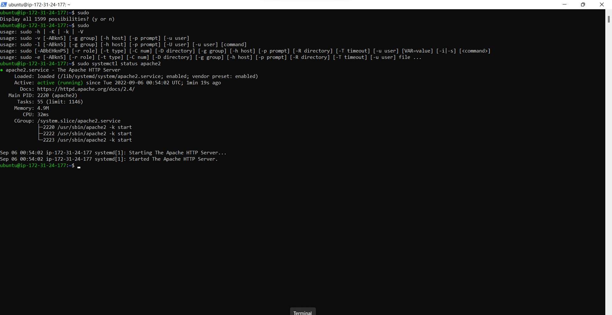
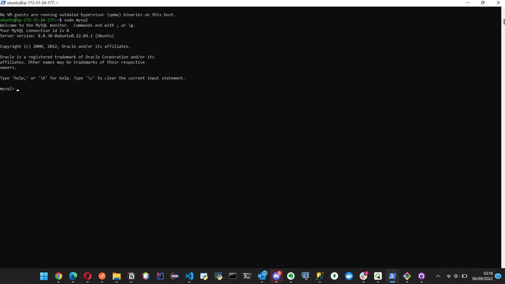
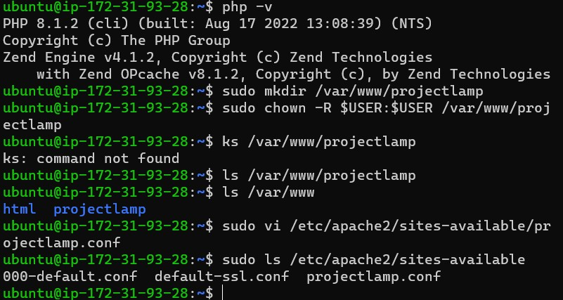
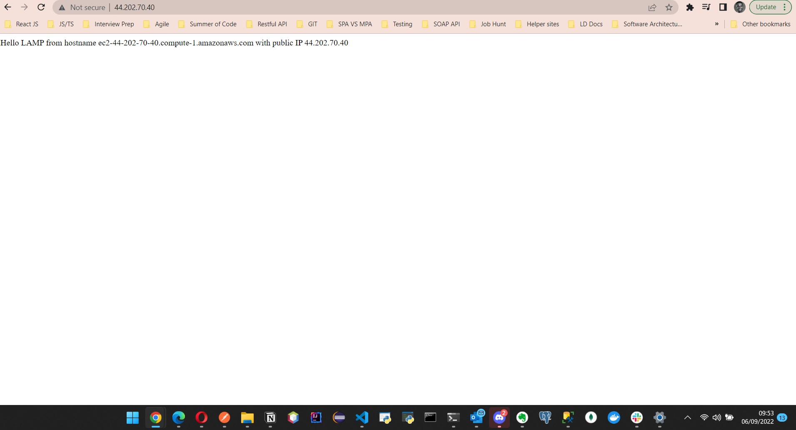
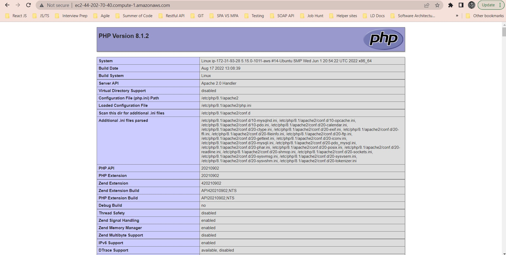

# Step 1 - installing apache and updating the firewall

Install Apache using Ubuntu’s package manager ‘apt’:

#update a list of packages in package manager
`sudo apt update`

#run apache2 package installation
`sudo apt install apache2`
To verify that apache2 is running as a Service in our OS, use following command

`sudo systemctl status apache2`

Test apache2 from a browser
`http://<Public-IP-Address>:80`

get ip address from the console
`curl -s http://169.254.169.254/latest/meta-data/public-ipv4`

# Step 2 - Install SQL
`$ sudo apt install mysql-server`
When prompted, confirm installation by typing Y, and then ENTER.

When the installation is finished, log in to the MySQL console by typing:

`$ sudo mysql`

It’s recommended that you run a security script that comes pre-installed with MySQL. This script will remove some insecure default settings and lock down access to your database system. Before running the script you will set a password for the root user, using mysql_native_password as default authentication method. We’re defining this user’s password as PassWord.1.

`ALTER USER 'root'@'localhost' IDENTIFIED WITH mysql_native_password BY 'PassWord.1';`

exit the shell

`mysql> exit`

Start the interactive script by running:

`$ sudo mysql_secure_installation`

login to the sql console
`$ sudo mysql -p`
Notice the -p flag in this command, which will prompt you for the password used after changing the root user password.

To exit the MySQL console, type:
`mysql> exit`

# Step 3 - INSTALLING PHP
PHP is the component of our setup that will process code to display dynamic content to the end user. In addition to the php package, you’ll need php-mysql, a PHP module that allows PHP to communicate with MySQL-based databases. You’ll also need libapache2-mod-php to enable Apache to handle PHP files. Core PHP packages will automatically be installed as dependencies.

To install these 3 packages at once, run:

`sudo apt install php libapache2-mod-php php-mysql`

Once the installation is finished, you can run the following command to confirm your PHP version:

`php -v`
Output: PHP 7.4.3 (cli) (built: Oct  6 2020 15:47:56) ( NTS )
Copyright (c) The PHP Group
Zend Engine v3.4.0, Copyright (c) Zend Technologies

# Step 4 - CREATING A VIRTUAL HOST FOR YOUR WEBSITE USING APACHE
Apache on Ubuntu 20.04 has one server block enabled by default that is configured to serve documents from the /var/www/html directory.
We will leave this configuration as is and will add our own directory next next to the default one.

Create the directory for projectlamp using ‘mkdir’ command as follows:

`sudo mkdir /var/www/projectlamp`

Next, assign ownership of the directory with your current system user:

 `sudo chown -R $USER:$USER /var/www/projectlamp`

Then, create and open a new configuration file in Apache’s sites-available directory using your preferred command-line editor. Here, we’ll be using vi or vim (They are the same by the way):

`sudo vi /etc/apache2/sites-available/projectlamp.conf`

This will create a new blank file. Paste in the following bare-bones configuration by hitting on i on the keyboard to enter the insert mode, and paste the text:

`<VirtualHost *:80>
    ServerName projectlamp
    ServerAlias www.projectlamp 
    ServerAdmin webmaster@localhost
    DocumentRoot /var/www/projectlamp
    ErrorLog ${APACHE_LOG_DIR}/error.log
    CustomLog ${APACHE_LOG_DIR}/access.log combined
</VirtualHost>`

To save and close the file, simply follow the steps below:

Hit the esc button on the keyboard
Type :
Type wq. w for write and q for quit
Hit ENTER to save the file
You can use the ls command to show the new file in the sites-available directory

`sudo ls /etc/apache2/sites-available`

With this VirtualHost configuration, we’re telling Apache to serve projectlamp using /var/www/projectlampl as its web root directory. If you would like to test Apache without a domain name, you can remove or comment out the options ServerName and ServerAlias by adding a # character in the beginning of each option’s lines. Adding the # character there will tell the program to skip processing the instructions on those lines.

You can now use a2ensite command to enable the new virtual host:

`sudo a2ensite projectlamp`

You might want to disable the default website that comes installed with Apache. This is required if you’re not using a custom domain name, because in this case Apache’s default configuration would overwrite your virtual host. To disable Apache’s default website use a2dissite command , type:

`sudo a2dissite 000-default`

To make sure your configuration file doesn’t contain syntax errors, run:

`sudo apache2ctl configtest`

Finally, reload Apache so these changes take effect:

sudo systemctl reload apache2
Your new website is now active, but the web root /var/www/projectlamp is still empty. Create an index.html file in that location so that we can test that the virtual host works as expected:

`sudo echo 'Hello LAMP from hostname' $(curl -s http://169.254.169.254/latest/meta-data/public-hostname) 'with public IP' $(curl -s http://169.254.169.254/latest/meta-data/public-ipv4) > /var/www/projectlamp/index.html`

Now go to your browser and try to open your website URL using IP address

ps: remember to remove or rename the index.html file from your document root after setting up index.php, as it would take precedence over an index.php file by default.

# step 5 - ENABLE PHP ON THE WEBSITE
edit the /etc/apache2/mods-enabled/dir.conf file and change the order in which the index.php file is listed within the DirectoryIndex directive:

`sudo vim /etc/apache2/mods-enabled/dir.conf`

`<IfModule mod_dir.c>
        #Change this:
        #DirectoryIndex index.html index.cgi index.pl index.php index.xhtml index.htm
        #To this:
        DirectoryIndex index.php index.html index.cgi index.pl index.xhtml index.htm
</IfModule>`

After saving and closing the file, you will need to reload Apache so the changes take effect:

`sudo systemctl reload apache2`

Create a PHP script to test that PHP is correctly installed and configured on your server.

`vim /var/www/projectlamp/index.php`

This will open a blank file. Add the following text, which is valid PHP code, inside the file:

`<?php`
`phpinfo();`

When you are finished, save and close the file, refresh the page and you will see a page similar to this:

remove the file as it contains sensitive information about your PHP environment -and your Ubuntu server.

`sudo rm /var/www/projectlamp/index.php`

You can always recreate this page if you need to access the information again later.

Credit: This guide was inspired by Digital Ocean

Congratulations! You have finished your very first REAL LIFE PROJECT by deploying a LAMP stack website in AWS Cloud!

