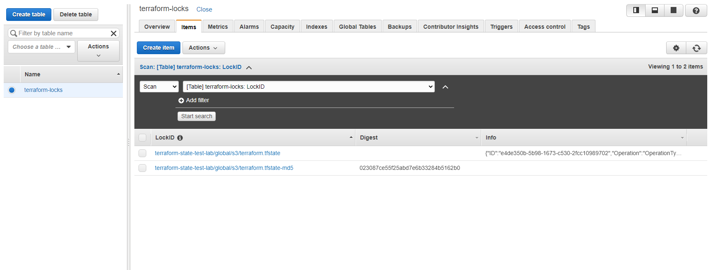
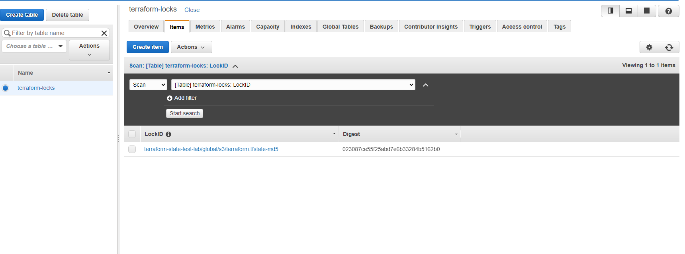
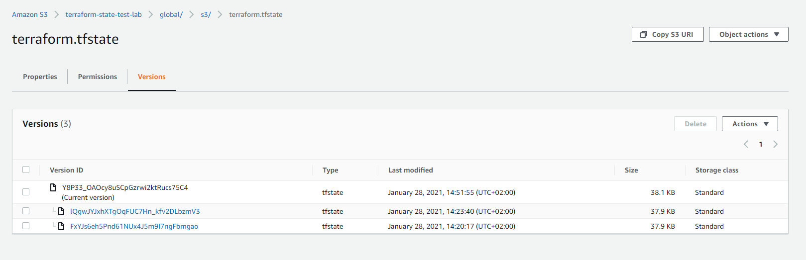

# AUTOMATE INFRASTRUCTURE WITH IAC USING TERRAFORM. PART 3 – REFACTORING
Start ProjectSubmit Project for Review
In two previous projects you have developed AWS Infrastructure code using Terraform and tried to run it from your local workstation.
Now it is time to introduce some more advanced concepts and enhance your code.

Firstly, we will explore alternative [Terraform backends.](https://developer.hashicorp.com/terraform/language/settings/backends/configuration)

# Introducing Backend on S3
Each Terraform configuration can specify a backend, which defines where and how operations are performed, where state snapshots are stored, etc.
Take a peek into what the states file looks like. It is basically where terraform stores all the state of the infrastructure in json format.

So far, we have been using the default backend, which is the local backend – it requires no configuration, and the states file is stored locally. This mode can be suitable for learning purposes, but it is not a robust solution, so it is better to store it in some more reliable and durable storage.

The second problem with storing this file locally is that, in a team of multiple DevOps engineers, other engineers will not have access to a state file stored locally on your computer.

To solve this, we will need to configure a backend where the state file can be accessed remotely other DevOps team members. There are plenty of different standard backends supported by Terraform that you can choose from. Since we are already using AWS – we can choose an [S3 bucket as a backend.](https://www.terraform.io/docs/language/settings/backends/s3.html)

Another useful option that is supported by S3 backend is [State Locking](https://www.terraform.io/docs/language/state/locking.html) – it is used to lock your state for all operations that could write state. This prevents others from acquiring the lock and potentially corrupting your state. State Locking feature for S3 backend is optional and requires another AWS service – [DynamoDB](https://aws.amazon.com/dynamodb/).

Let us configure it!

Here is our plan to Re-initialize Terraform to use S3 backend:

- Add S3 and DynamoDB resource blocks before deleting the local state file
- Update terraform block to introduce backend and locking
- Re-initialize terraform
- Delete the local tfstate file and check the one in S3 bucket
- Add outputs
- terraform apply
To get to know how lock in DynamoDB works, [read the following article](https://angelo-malatacca83.medium.com/aws-terraform-s3-and-dynamodb-backend-3b28431a76c1)

1. Create a file and name it backend.tf. Add the below code and replace the name of the S3 bucket you created in Project-16.

```
# Note: The bucket name may not work for you since buckets are unique globally in AWS, so you must give it a unique name.
resource "aws_s3_bucket" "terraform_state" {
  bucket = "dev-terraform-bucket"
  # Enable versioning so we can see the full revision history of our state files
  versioning {
    enabled = true
  }
  # Enable server-side encryption by default
  server_side_encryption_configuration {
    rule {
      apply_server_side_encryption_by_default {
        sse_algorithm = "AES256"
      }
    }
  }
}
```

You must be aware that Terraform stores secret data inside the state files. Passwords, and secret keys processed by resources are always stored in there. Hence, you must consider to always enable encryption. You can see how we achieved that with [server_side_encryption_configuration](https://docs.aws.amazon.com/AmazonS3/latest/userguide/serv-side-encryption.html).

2. Next, we will create a DynamoDB table to handle locks and perform consistency checks. In previous projects, locks were handled with a local file as shown in terraform.tfstate.lock.info. Since we now have a team mindset, causing us to configure S3 as our backend to store state file, we will do the same to handle locking. Therefore, with a cloud storage database like DynamoDB, anyone running Terraform against the same infrastructure can use a central location to control a situation where Terraform is running at the same time from multiple different people.

## Dynamo DB resource for locking and consistency checking:

```
resource "aws_dynamodb_table" "terraform_locks" {
  name         = "terraform-locks"
  billing_mode = "PAY_PER_REQUEST"
  hash_key     = "LockID"
  attribute {
    name = "LockID"
    type = "S"
  }
}
```

Terraform expects that both S3 bucket and DynamoDB resources are already created before we configure the backend. So, let us run `terraform apply` to provision resources.

3. Configure S3 Backend

```
terraform {
  backend "s3" {
    bucket         = "dev-terraform-bucket"
    key            = "global/s3/terraform.tfstate"
    region         = "eu-central-1"
    dynamodb_table = "terraform-locks"
    encrypt        = true
  }
}
```

Now its time to re-initialize the backend. Run `terraform init` and confirm you are happy to change the backend by typing yes

4. Verify the changes
Before doing anything if you opened AWS now to see what happened you should be able to see the following:

- tfstatefile is now inside the S3 bucket


- DynamoDB table which we create has an entry which includes state file status


Navigate to the DynamoDB table inside AWS and leave the page open in your browser. Run `terraform plan` and while that is running, refresh the browser and see how the lock is being handled:



- After terraform plan completes, refresh DynamoDB table.



5. Add Terraform Output
Before you run `terraform apply` let us add an output so that the S3 bucket [Amazon Resource Names ARN](https://docs.aws.amazon.com/general/latest/gr/aws-arns-and-namespaces.html) and DynamoDB table name can be displayed.

Create a new file and name it output.tf and add below code.

```
output "s3_bucket_arn" {
  value       = aws_s3_bucket.terraform_state.arn
  description = "The ARN of the S3 bucket"
}
output "dynamodb_table_name" {
  value       = aws_dynamodb_table.terraform_locks.name
  description = "The name of the DynamoDB table"
}
```
Now we have everything ready to go!

6. Let us run `terraform apply`
Terraform will automatically read the latest state from the S3 bucket to determine the current state of the infrastructure. Even if another engineer has applied changes, the state file will always be up to date.

Now, head over to the S3 console again, refresh the page, and click the grey “Show” button next to “Versions.” You should now see several versions of your terraform.tfstate file in the S3 bucket:



With help of remote backend and locking configuration that we have just configured, collaboration is no longer a problem.

However, there is still one more problem: Isolation Of Environments. Most likely we will need to create resources for different environments, such as: Dev, sit, uat, preprod, prod, etc.

This separation of environments can be achieved using one of two methods:

a. Terraform Workspaces
b. Directory based separation using terraform.tfvars file

## WHEN TO USE WORKSPACES OR DIRECTORY?
To separate environments with significant configuration differences, use a directory structure. Use workspaces for environments that do not greatly deviate from each other, to avoid duplication of your configurations. Try both methods in the sections below to help you understand which will serve your infrastructure best.

For now, you can read more about both alternatives here and try both methods yourself, but we will explore them better in next projects.

### Security Groups refactoring with dynamic block
For repetitive blocks of code you can use [dynamic blocks](https://www.terraform.io/docs/language/expressions/dynamic-blocks.html) in Terraform, to get to know more how to use them – [watch this video](https://youtu.be/tL58Qt-RGHY).

Refactor Security Groups creation with dynamic blocks.

## EC2 refactoring with Map and Lookup
Remember, every piece of work you do, always try to make it dynamic to accommodate future changes. [Amazon Machine Image (AMI)](https://docs.aws.amazon.com/AWSEC2/latest/UserGuide/AMIs.html) is a regional service which means it is only available in the region it was created. But what if we change the region later, and want to dynamically pick up AMI IDs based on the available AMIs in that region? This is where we will introduce Map and Lookup functions.

Map uses a key and value pairs as a data structure that can be set as a default type for variables.

```
variable "images" {
    type = "map"
    default = {
        us-east-1 = "image-1234"
        us-west-2 = "image-23834"
    }
}
```

To select an appropriate AMI per region, we will use a lookup function which has following syntax: lookup(map, key, [default]).

**Note:** A default value is better to be used to avoid failure whenever the map data has no key.

```
resource "aws_instance" "web" {
    ami  = "${lookup(var.images, var.region), "ami-12323"}
}
```

Now, the lookup function will load the variable images using the first parameter. But it also needs to know which of the key-value pairs to use. That is where the second parameter comes in. The key us-east-1 could be specified, but then we will not be doing anything dynamic there, but if we specify the variable for region, it simply resolves to one of the keys. That is why we have used var.region in the second parameter.

**Conditional Expressions**
If you want to make some decision and choose some resource based on a condition – you shall use [Terraform Conditional Expressions.](https://www.terraform.io/docs/language/expressions/conditionals.html)

In general, the syntax is as following: `condition ? true_val : false_val`

Read following snippet of code and try to understand what it means:

```
resource "aws_db_instance" "read_replica" {
  count               = var.create_read_replica == true ? 1 : 0
  replicate_source_db = aws_db_instance.this.id
}
```

- true #condition equals to ‘if true’
- ? #means, set to ‘1`
- : #means, otherwise, set to ‘0’

## Terraform Modules and best practices to structure your .tf codes
By this time, you might have realized how difficult is to navigate through all the Terraform blocks if they are all written in a single long .tf file. As a DevOps engineer, you must produce reusable and comprehensive IaC code structure, and one of the tool that Terraform provides out of the box is [Modules](https://www.terraform.io/docs/language/modules/index.html).

Modules serve as containers that allow to logically group Terraform codes for similar resources in the same domain (e.g., Compute, Networking, AMI, etc.). One **root module** can call other **child modules** and insert their configurations when applying Terraform config. This concept makes your code structure neater, and it allows different team members to work on different parts of configuration at the same time.

You can also create and publish your modules to Terraform Registry for others to use and use someone’s modules in your projects.

Module is just a collection of .tf and/or .tf.json files in a directory.

You can refer to existing child modules from your root module by specifying them as a source, like this:

```
module "network" {
  source = "./modules/network"
}
```

Note that the path to ‘network’ module is set as relative to your working directory.

Or you can also directly access resource outputs from the modules, like this:

```
resource "aws_elb" "example" {
  # ...

  instances = module.servers.instance_ids
}
```
In the example above, you will have to have module ‘servers’ to have output file to expose variables for this resource.

## REFACTOR YOUR PROJECT USING MODULES
Let us review the [repository from project 17](https://github.com/darey-devops/PBL-project-17.git), you will notice that we had a single list of long file for creating all of our resources, but that is not the best way to go about it because it makes our code base vey hard to read and understand therefore making future changes can be quite stressful.

**QUICK TASK FOR YOU:** Break down your Terraform codes to have all resources in their respective modules. Combine resources of a similar type into directories within a ‘modules’ directory, for example, like this:

```
- modules
  - ALB: For Application Load balancer and similar resources
  - EFS: For Elastic file system resources
  - RDS: For Databases resources
  - Autoscaling: For Autosacling and launch template resources
  - compute: For EC2 and rlated resources
  - VPC: For VPC and netowrking resources such as subnets, roles, e.t.c.
  - security: for creating security group resources
```

- Each module shall contain following files:

```
- main.tf (or %resource_name%.tf) file(s) with resources blocks
- outputs.tf (optional, if you need to refer outputs from any of these resources in your root module)
- variables.tf (as we learned before - it is a good practice not to hard code the values and use variables)
```

It is also recommended to configure providers and backends sections in separate files but should be placed in the root module.

After you have given it a try, you can check out this [repository](https://github.com/darey-devops/PBL-project-18.git) for guidance and errors fixing.

**IMPORTANT:** In the configuration sample from the repository, you can observe two examples of referencing the module:

a. Import module as a source and have access to its variables via var keyword:

```
module "VPC" {
  source = "./modules/VPC"
  region = var.region
  ...
```

b. Refer to a module’s output by specifying the full path to the output variable by using module.`%module_name%.%output_name%` construction:

`subnets-compute = module.network.public_subnets-1`

## COMPLETE THE TERRAFORM CONFIGURATION
Complete the rest of the codes yourself, the resulting configuration structure in your working directory may look like this:

```
└── PBL
    ├── modules
    |   ├── ALB
    |     ├── ... (module .tf files, e.g., main.tf, outputs.tf, variables.tf)     
    |   ├── EFS
    |     ├── ... (module .tf files) 
    |   ├── RDS
    |     ├── ... (module .tf files) 
    |   ├── autoscaling
    |     ├── ... (module .tf files) 
    |   ├── compute
    |     ├── ... (module .tf files) 
    |   ├── network
    |     ├── ... (module .tf files)
    |   ├── security
    |     ├── ... (module .tf files)
    ├── main.tf
    ├── backends.tf
    ├── providers.tf
    ├── data.tf
    ├── outputs.tf
    ├── terraform.tfvars
    └── variables.tf
```

Now, the code is much more well-structured and can be easily read, edited and reused by your DevOps team members.

**BLOCKERS:** Your website would not be available because the userdata scripts we added to the launch template does not contain the latest endpoints for EFS, ALB and RDS and also our AMI is not properly configured, so how do we fix this?

In project 19, you would see how to use packer to create AMIs, Terraform to create the infrastructure and Ansible to configure the infrastructure.

We will also see how to use terraform cloud for our backends.

**Pro-tips:**

1. You can validate your codes before running `terraform plan` with `terraform validate` command. It will check if your code is syntactically valid and internally consistent.

2. In order to make your configuration files more readable and follow canonical format and style – use terraform fmt command. It will apply Terraform language style conventions and format your .tf files in accordance to them.