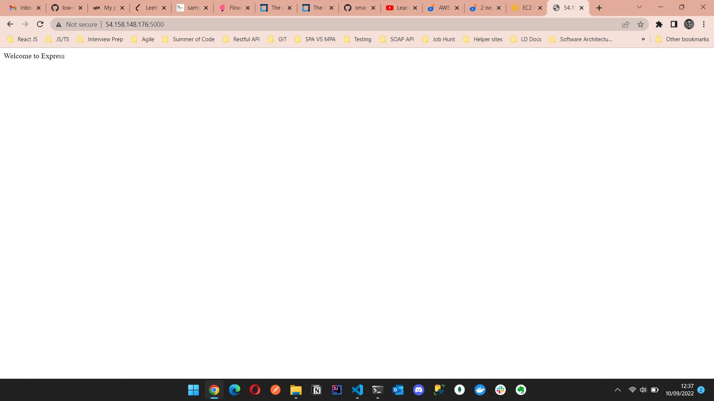
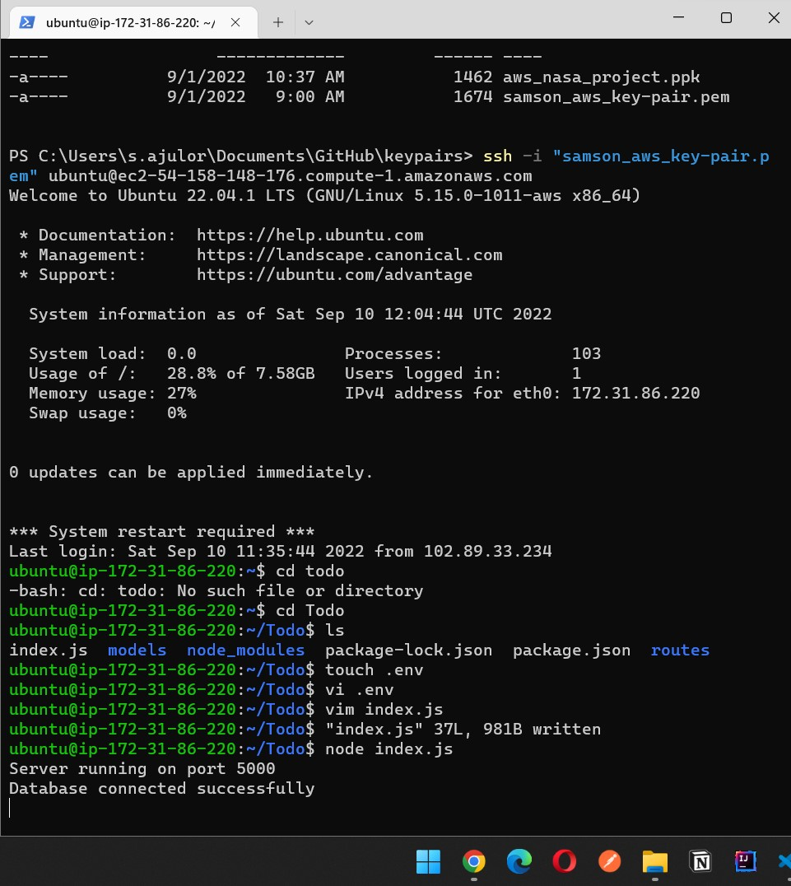
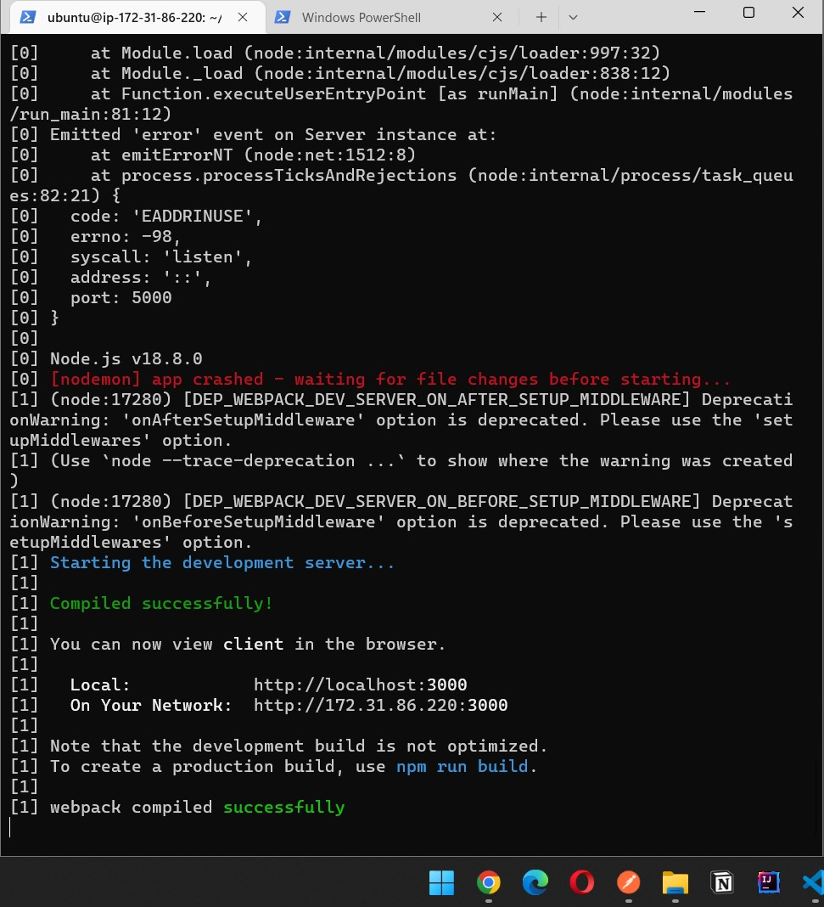

# STEP 1 – BACKEND CONFIGURATION
Update ubuntu

`sudo apt update`

Upgrade ubuntu

`sudo apt upgrade`

Lets get the location of Node.js software from Ubuntu repositories.

`curl -fsSL https://deb.nodesource.com/setup_18.x | sudo -E bash -`

Install Node.js on the server
Install Node.js with the command below

`sudo apt-get install -y nodejs`

Verify the node installation with the command below

`node -v`

Verify the node installation with the command below

`npm -v` 


- Application Code Setup
Create a new directory for your To-Do project:

`mkdir Todo`

Run the command below to verify that the Todo directory is created with ls command

`ls`

Now change your current directory to the newly created one:

`cd Todo`

Next, you will use the command npm init to initialise your project, so that a new file named package.json will be created.

`npm init`

Next, we will Install ExpressJs and create the Routes directory.


- Install ExpressJS

`npm install express`

Now create a file index.js with the command below

`touch index.js`

Install the dotenv module

`npm install dotenv`

Open the index.js file with the command below

`vim index.js`

Type the code below into it and save.

```
const express = require('express');
require('dotenv').config();

const app = express();

const port = process.env.PORT || 5000;

app.use((req, res, next) => {
res.header("Access-Control-Allow-Origin", "\*");
res.header("Access-Control-Allow-Headers", "Origin, X-Requested-With, Content-Type, Accept");
next();
});

app.use((req, res, next) => {
res.send('Welcome to Express');
});

app.listen(port, () => {
console.log(`Server running on port ${port}`)
});
```
Notice that we have specified to use port 5000 in the code. This will be required later when we go on the browser.:

Use :w to save in vim and use :qa to exit vim

Now it is time to start our server to see if it works. Open your terminal in the same directory as your index.js file and type:

`node index.js`


Open up your browser and try to access your server’s Public IP or Public DNS name followed by port 5000:

`http://<PublicIP-or-PublicDNS>:5000`



- Routes
There are three actions that our To-Do application needs to be able to do:

1. Create a new task
2. Display list of all tasks
3. Delete a completed task
Each task will be associated with some particular endpoint and will use different standard HTTP request methods: POST, GET, DELETE.

For each task, we need to create routes that will define various endpoints that the To-do app will depend on. So let us create a folder routes

`mkdir routes`

`cd routes`

`touch api.js`

`vim api.js`

Copy below code in the file. (Do not be overwhelmed with the code)

```
const express = require ('express');
const router = express.Router();

router.get('/todos', (req, res, next) => {

});

router.post('/todos', (req, res, next) => {

});

router.delete('/todos/:id', (req, res, next) => {

})

module.exports = router;
```

Moving forward let create Models directory.

- MODELS
A model is at the heart of JavaScript based applications, and it is what makes it interactive.

Change directory back Todo folder with cd .. and install Mongoose

`npm install mongoose`

`mkdir models && cd models && touch todo.js`

Open the file created with vim todo.js then paste the code below in the file:

```
const mongoose = require('mongoose');
const Schema = mongoose.Schema;

//create schema for todo
const TodoSchema = new Schema({
action: {
type: String,
required: [true, 'The todo text field is required']
}
})

//create model for todo
const Todo = mongoose.model('todo', TodoSchema);

module.exports = Todo;
```

In Routes directory, open api.js with vim api.js, delete the code inside with :%d command and paste there code below into it then save and exit

```
const express = require ('express');
const router = express.Router();
const Todo = require('../models/todo');

router.get('/todos', (req, res, next) => {

//this will return all the data, exposing only the id and action field to the client
Todo.find({}, 'action')
.then(data => res.json(data))
.catch(next)
});

router.post('/todos', (req, res, next) => {
if(req.body.action){
Todo.create(req.body)
.then(data => res.json(data))
.catch(next)
}else {
res.json({
error: "The input field is empty"
})
}
});

router.delete('/todos/:id', (req, res, next) => {
Todo.findOneAndDelete({"_id": req.params.id})
.then(data => res.json(data))
.catch(next)
})

module.exports = router;
```

The next piece of our application will be the MongoDB Database

- MongoDB Database

Create a MongoDB database and collection inside mLab

In the index.js file, we specified process.env to access environment variables, but we have not yet created this file. So we need to do that now.

Create a file in your Todo directory and name it .env.

`touch .env`
`vi .env`
Add the connection string to access the database in it, just as below:

`DB = 'mongodb+srv://<username>:<password>@<network-address>/<dbname>?retryWrites=true&w=majority'`

Delete existing content in the file. Press i to enter the insert mode in vim
Now, paste the entire code below in the file.
```
const express = require('express');
const bodyParser = require('body-parser');
const mongoose = require('mongoose');
const routes = require('./routes/api');
const path = require('path');
require('dotenv').config();

const app = express();

const port = process.env.PORT || 5000;

//connect to the database
mongoose.connect(process.env.DB, { useNewUrlParser: true, useUnifiedTopology: true })
.then(() => console.log(`Database connected successfully`))
.catch(err => console.log(err));

//since mongoose promise is depreciated, we overide it with node's promise
mongoose.Promise = global.Promise;

app.use((req, res, next) => {
res.header("Access-Control-Allow-Origin", "\*");
res.header("Access-Control-Allow-Headers", "Origin, X-Requested-With, Content-Type, Accept");
next();
});

app.use(bodyParser.json());

app.use('/api', routes);

app.use((err, req, res, next) => {
console.log(err);
next();
});

app.listen(port, () => {
console.log(`Server running on port ${port}`)
});
```

Start your server using the command:

node index.js



- Testing Backend Code without Frontend using RESTful API

In this project, we will use Postman to test our API.
Click Install Postman to download and install postman on your machine.

Now open your Postman, create a POST request to the API 

`http://<PublicIP-or-PublicDNS>:5000/api/todos`

Note: make sure your set header key Content-Type as application/json

Create a GET request to your API on 

`http://<PublicIP-or-PublicDNS>:5000/api/todos`

This request retrieves all existing records from out To-do application.


# Step 2 – Frontend creation

In the same root directory as your backend code, which is the Todo directory, run:

 `npx create-react-app client`

- Running a React App

Install concurrently.

`npm install concurrently --save-dev`

Install nodemon.

`npm install nodemon --save-dev`

In Todo folder open the package.json file. Change the highlighted part of the below screenshot and replace with the code below.

```
"scripts": {
"start": "node index.js",
"start-watch": "nodemon index.js",
"dev": "concurrently \"npm run start-watch\" \"cd client && npm start\""
},
```

- Configure Proxy in package.json
Change directory to ‘client’

`cd client`

Open the package.json file
`vi package.json`

Add the key value pair in the package.json file `"proxy": "http://localhost:5000"`.
The whole purpose of adding the proxy configuration in number 3 above is to make it possible to access the application directly from the browser by simply calling the server url like `http://localhost:5000` rather than always including the entire path like `http://localhost:5000/api/todos`

Now, ensure you are inside the Todo directory, and simply do:

npm run dev
Your app should open and start running on localhost:3000



Important note: In order to be able to access the application from the Internet you have to open TCP port 3000 on EC2 by adding a new Security Group rule.


- Creating your React Components

`cd client && cd src && mkdir components && cd components`

Inside ‘components’ directory create three files Input.js, ListTodo.js and Todo.js.

`touch Input.js ListTodo.js Todo.js`

Open Input.js file

`vi Input.js`
Copy and paste the following

```
import React, { Component } from 'react';
import axios from 'axios';

class Input extends Component {

state = {
action: ""
}

addTodo = () => {
const task = {action: this.state.action}

    if(task.action && task.action.length > 0){
      axios.post('/api/todos', task)
        .then(res => {
          if(res.data){
            this.props.getTodos();
            this.setState({action: ""})
          }
        })
        .catch(err => console.log(err))
    }else {
      console.log('input field required')
    }

}

handleChange = (e) => {
this.setState({
action: e.target.value
})
}

render() {
let { action } = this.state;
return (
<div>
<input type="text" onChange={this.handleChange} value={action} />
<button onClick={this.addTodo}>add todo</button>
</div>
)
}
}

export default Input
```

Move to clients folder

`cd ../..`

Install Axios

`npm install axios`

- FRONTEND CREATION (CONTINUED)
Go to ‘components’ directory

`cd src/components`

After that open your ListTodo.js

`vi ListTodo.js`
in the ListTodo.js copy and paste the following code

```
import React from 'react';

const ListTodo = ({ todos, deleteTodo }) => {

return (
<ul>
{
todos &&
todos.length > 0 ?
(
todos.map(todo => {
return (
<li key={todo._id} onClick={() => deleteTodo(todo._id)}>{todo.action}</li>
)
})
)
:
(
<li>No todo(s) left</li>
)
}
</ul>
)
}

export default ListTodo
```

Then in your Todo.js file you write the following code

```
import React, {Component} from 'react';
import axios from 'axios';

import Input from './Input';
import ListTodo from './ListTodo';

class Todo extends Component {

state = {
todos: []
}

componentDidMount(){
this.getTodos();
}

getTodos = () => {
axios.get('/api/todos')
.then(res => {
if(res.data){
this.setState({
todos: res.data
})
}
})
.catch(err => console.log(err))
}

deleteTodo = (id) => {

    axios.delete(`/api/todos/${id}`)
      .then(res => {
        if(res.data){
          this.getTodos()
        }
      })
      .catch(err => console.log(err))

}

render() {
let { todos } = this.state;

    return(
      <div>
        <h1>My Todo(s)</h1>
        <Input getTodos={this.getTodos}/>
        <ListTodo todos={todos} deleteTodo={this.deleteTodo}/>
      </div>
    )

}
}

export default Todo;
```

Move to the src folder

`cd ..`

Make sure that you are in the src folder and run

`vi App.js`
Copy and paste the code below into it

```
import React from 'react';

import Todo from './components/Todo';
import './App.css';

const App = () => {
return (
<div className="App">
<Todo />
</div>
);
}

export default App;
```

After pasting, exit the editor.

In the src directory open the App.css

`vi App.css`
Then paste the following code into App.css:

```
.App {
text-align: center;
font-size: calc(10px + 2vmin);
width: 60%;
margin-left: auto;
margin-right: auto;
}

input {
height: 40px;
width: 50%;
border: none;
border-bottom: 2px #101113 solid;
background: none;
font-size: 1.5rem;
color: #787a80;
}

input:focus {
outline: none;
}

button {
width: 25%;
height: 45px;
border: none;
margin-left: 10px;
font-size: 25px;
background: #101113;
border-radius: 5px;
color: #787a80;
cursor: pointer;
}

button:focus {
outline: none;
}

ul {
list-style: none;
text-align: left;
padding: 15px;
background: #171a1f;
border-radius: 5px;
}

li {
padding: 15px;
font-size: 1.5rem;
margin-bottom: 15px;
background: #282c34;
border-radius: 5px;
overflow-wrap: break-word;
cursor: pointer;
}

@media only screen and (min-width: 300px) {
.App {
width: 80%;
}

input {
width: 100%
}

button {
width: 100%;
margin-top: 15px;
margin-left: 0;
}
}

@media only screen and (min-width: 640px) {
.App {
width: 60%;
}

input {
width: 50%;
}

button {
width: 30%;
margin-left: 10px;
margin-top: 0;
}
}
```

In the src directory open the index.css

`vim index.css`
Copy and paste the code below:

```
body {
margin: 0;
padding: 0;
font-family: -apple-system, BlinkMacSystemFont, "Segoe UI", "Roboto", "Oxygen",
"Ubuntu", "Cantarell", "Fira Sans", "Droid Sans", "Helvetica Neue",
sans-serif;
-webkit-font-smoothing: antialiased;
-moz-osx-font-smoothing: grayscale;
box-sizing: border-box;
background-color: #282c34;
color: #787a80;
}

code {
font-family: source-code-pro, Menlo, Monaco, Consolas, "Courier New",
monospace;
}
```

Go to the Todo directory

`cd ../..`

When you are in the Todo directory run:

`npm run dev`


Congratulations

Credits:

This guide was inspired by Digital Ocean
Educative.io

[video tutorial](https://www.youtube.com/watch?v=56UAAenMEx8)