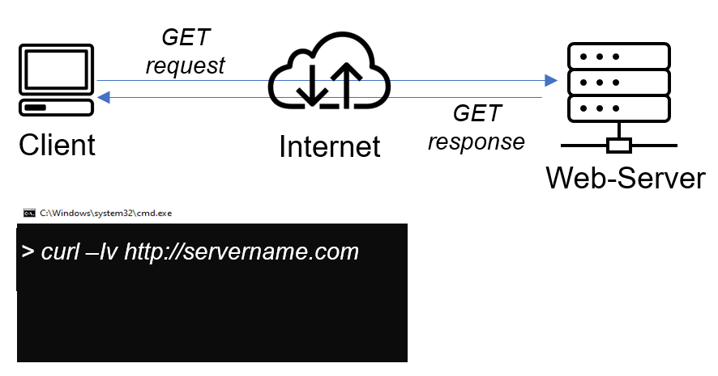
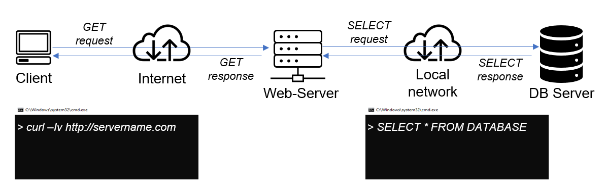
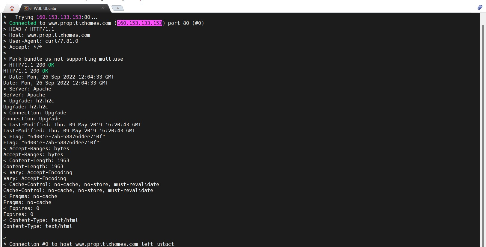
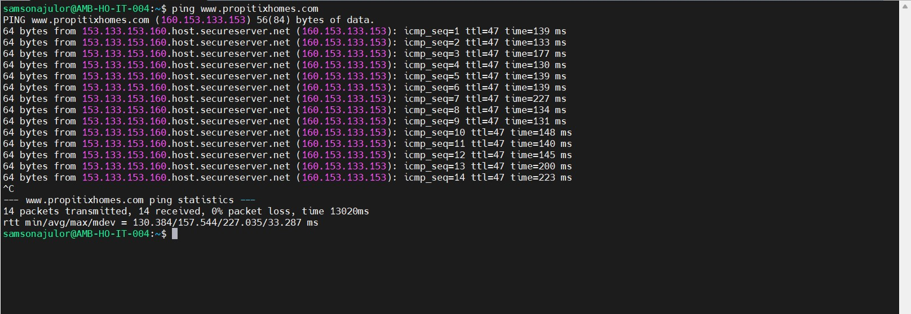

# Understanding Client-Server Architecture
Client-Server refers to an architecture in which two or more computers are connected together over a network to send and receive requests between one another.

In their communication, each machine has its own role: the machine sending requests is usually referred as "Client" and the machine responding (serving) is called "Server".

A simple diagram of Web Client-Server architecture is presented below:

In the example above, a machine that is trying to access a Web site using Web browser or simply ‘curl’ command is a client and it sends HTTP requests to a Web server (Apache, Nginx, IIS or any other) over the Internet.

If we extend this concept further and add a Database Server to our architecture, we can get this picture:

In this case, our Web Server has a role of a "Client" that connects and reads/writes to/from a Database (DB) Server (MySQL, MongoDB, Oracle, SQL Server or any other), and the communication between them happens over a Local Network (it can also be Internet connection, but it is a common practice to place Web Server and DB Server close to each other in local network).

Lets take a very quick example and see Client-Server communicatation in action.

Open up your Ubuntu or Windows terminal and run curl command:

`curl -Iv www.propitixhomes.com`

you can install it by running `sudo apt install curl`

In this example, your terminal will be the client, while www.propitixhomes.com will be the server.

See the response from the remote server in below output. You can also see that the requests from the URL are being served by a computer with an IP address 160.153.133.153 on port 80. More on IP addresses and ports when we get to Networking related projects

Another simple way to get a server’s IP address is to use a simple diagnostic tool like ‘ping’, it will also show round-trip time – time for packets to go to and back from the server, this tool uses ICMP protocol.

`ping -Iv www.propitixhomes.com`

## To demonstrate a basic client-server using MySQL Relational Database Management System (RDBMS), follow the below instructions

- Create and configure two Linux-based virtual servers (EC2 instances in AWS).
Server A name - mysql server
Server B name - mysql client
`sudo apt update`
On mysql server Linux Server install MySQL Server software.
`sudo apt install mysql-server -y`
`sudo systemctl enable mysql`

On mysql client Linux Server install MySQL Client software.

By default, both of your EC2 virtual servers are located in the same local virtual network, so they can communicate to each other using local IP addresses. Use mysql server's local IP address to connect from mysql client. MySQL server uses TCP port 3306 by default, so you will have to open it by creating a new entry in ‘Inbound rules’ in ‘mysql server’ Security Groups. For extra security, do not allow all IP addresses to reach your ‘mysql server’ – allow access only to the specific local IP address of your ‘mysql client’.

`ALTER USER 'root'@'localhost' IDENTIFIED WITH mysql_native_password BY 'PassWord.1';`

`sudo mysql_secure_installation`

`sudo mysql -u -p`

`CREATE USER 'samson_remote'@'%' IDENTIFIED WITH mysql_native_password BY 'password';`

`CREATE DATABASE test_db`

`GRANT ALL ON test_db.* TO 'samson_remote'@'%' WITH GRANT OPTION;`

`FLUSH PRIVILEGES;`

You might need to configure MySQL server to allow connections from remote hosts.

`sudo vi /etc/mysql/mysql.conf.d/mysqld.cnf`

- Replace ‘127.0.0.1’ to ‘0.0.0.0’ like this:

`sudo systemctl restart mysql`

From mysql client Linux Server connect remotely to mysql server Database Engine without using SSH. You must use the mysql utility to perform this action.

Check that you have successfully connected to a remote MySQL server and can perform SQL queries:

Show databases;

[video tutorial](https://www.youtube.com/watch?v=jSPslwhYEG0)
