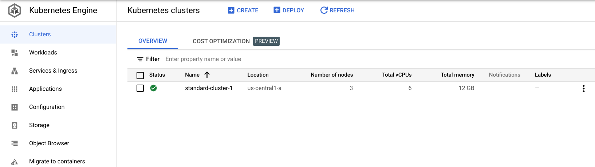
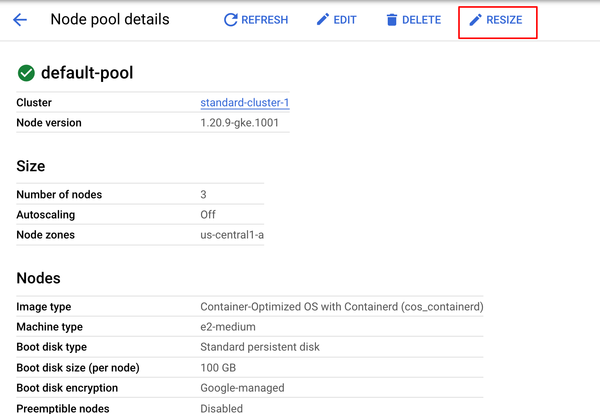

# Overview
In this lab, I used the Google Cloud Console to build GKE clusters and deploy a sample Pod.

## Objectives
In this lab, you learn how to perform the following tasks:

- Use the Google Cloud Console to build and manipulate GKE clusters.

Use the Google Cloud Console to deploy a Pod

- Use the Google Cloud Console to examine the cluster and Pods

## 1. Deploy GKE clusters
In this task, you use the Google Cloud Console and Cloud Shell to deploy GKE clusters.

### Use the Google Cloud Console to deploy a GKE cluster
- In the Google Cloud Console, on the Navigation menu, click Kubernetes Engine > Clusters.

- Click Create to begin creating a GKE cluster. Click **configure** for **Standard: You manage your cluster**.

- Examine the console UI and the controls to change the cluster name, the cluster location, Kubernetes version, the number of nodes, and the node resources such as the machine type in the default node pool.

Clusters can be created across a region or in a single zone. A single zone is the default. When you deploy across a region the nodes are deployed to three separate zones and the total number of nodes deployed will be three times higher.

- Change the cluster name to standard-cluster-1 and zone to us-central1-a. Leave all the values at their defaults and click Create.
The cluster begins provisioning.

---
Note: You need to wait a few minutes for the cluster deployment to complete.
---

When provisioning is complete, the Kubernetes Engine > Clusters page looks like the screenshot:

- Click the cluster name standard-cluster-1 to view the cluster details

- You can scroll down the page to view more details.

- Click the Storage and Nodes tabs under the cluster name (standard-cluster-1) at the top to view more of the cluster details.

### 2. Modify GKE clusters
It is easy to modify many of the parameters of existing clusters using either the Google Cloud Console or Cloud Shell. In this task, you use the Google Cloud Console to modify the size of GKE clusters.

- In the Google Cloud Console, on the Navigation menu, click Kubernetes Engine > Clusters > standard-cluster-1, click **NODES** at the top of the details page.
- In Node Pools section, click default-pool.
- In the Google Cloud Console, click **RESIZE** at the top of the Node Pool Details page.
- Change the number of nodes from 3 to 4 and click RESIZE.

- In the Google Cloud Console, on the Navigation menu, click Kubernetes Engine > Clusters.

When the operation completes, the Kubernetes Engine > Clusters page should show that standard-cluster-1 now has four nodes.

### 3. Deploy a sample workload
In this task, using the Google Cloud console you will deploy a Pod running the nginx web server as a sample workload.

- In the Google Cloud Console, on the Navigation menu, click Kubernetes Engine > Workloads.
- Click Deploy to show the Create a deployment wizard.
- Click Continue to accept the default container image, nginx:latest, which deploys 3 Pods each with a single container running the latest version of nginx.
- Scroll to the bottom of the window and click the Deploy button leaving the Configuration details at the defaults.
- When the deployment completes your screen will refresh to show the details of your new nginx deployment.

Click Check my progress to verify the objective.

### 4. View details about workloads in the Google Cloud Console
In this task, you view details of your GKE workloads directly in the Google Cloud Console.

- In the Google Cloud Console, on the Navigation menu, click Kubernetes Engine > Workloads.
- In the Google Cloud Console, on the Kubernetes Engine > Workloads page, click nginx-1.
This displays the overview information for the workload showing details like resource utilization charts, links to logs, and details of the Pods associated with this workload.

- In the Google Cloud Console, click the Details tab for the nginx-1 workload. The Details tab shows more details about the workload including the Pod specification, number and status of Pod replicas and details about the horizontal Pod autoscaler.

- Click the Revision History tab. This displays a list of the revisions that have been made to this workload.

- Click the Events tab. This tab lists events associated with this workload.

- And then the YAML tab. This tab provides the complete YAML file that defines these components and full configuration of this sample workload.

- Still in the Google Cloud Console's Details tab for the nginx-1 workload, click the Overview tab, scroll down to the Managed Pods section and click the name of one of the Pods to view the details page for that Pod.

- The Pod details page provides information on the Pod configuration and resource utilization and the node where the Pod is running.

- In the Pod details page, you can click the Events and Logs tabs to view event details and links to container logs in Cloud Operations.

- Click the YAML tab to view the detailed YAML file for the Pod configuration.

[link to documentation](https://googlepluralsight.qwiklabs.com/focuses/24782243?parent=lti_session)