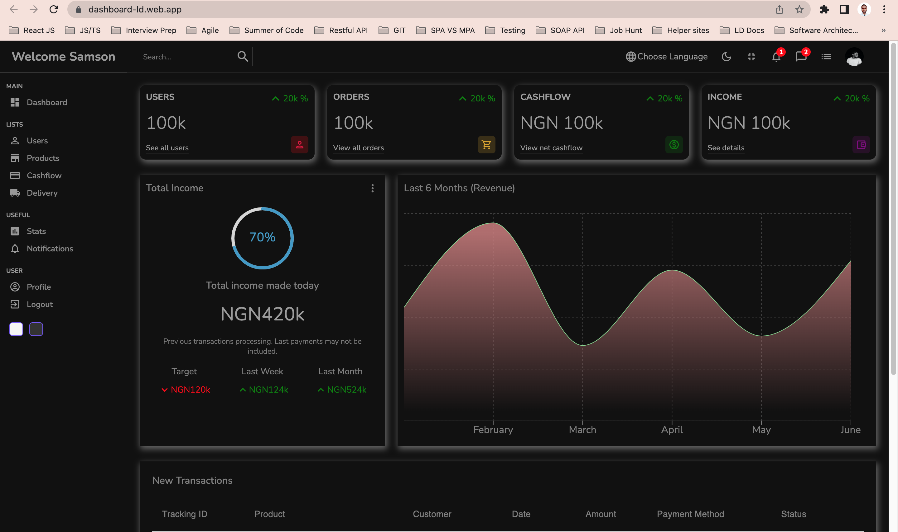

# React JS Dashboard with Light and Dark Mode

Implemented with reactJs, Redux, contextAPI, materialUI Icons, react charts

url: https://dashboard-ld.web.app/

Light mode preview

Dark mode preview

